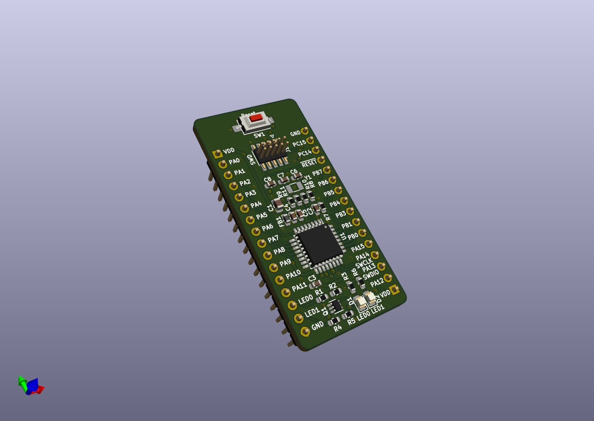

# STM32L010 Breakout Board (Rev. B)

Small MCU board designed primarly for the STM32L010K8T6 ARM Cortex-M0+ microcontroller: [Datasheet](https://www.st.com/resource/en/datasheet/stm32l010k8.pdf)
Can also be used with other pin-compatible STM32 MCUs in LQFP-32 package:
- Most of the STM32L0 family
- STM32L4x2 (ARM Cortex-M4)

## Features

- minimal subset of components, no power regulation (important when playing with low power apps)
- optional LSE crystal, if not used its GPIO pins can be connected to the user header by soldering relevant 0R resistors (see schematic)
- two buffered user LEDs, connected to the header - no reserved GPIOs
- reset button
- standard 0.05" pitch SWD programming header, SWD signals also present on the pin headers

Designed in KiCad 5.1.6

Schematic: [PDF](docs/stm32l010-breakout.pdf)

License: [CC BY-SA 4.0](https://creativecommons.org/licenses/by-sa/4.0/)
